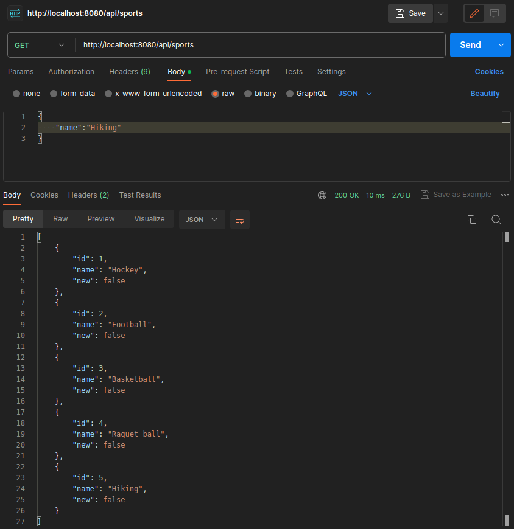

# Spring WebFlux Sport Management Project

This is a sample Spring WebFlux project that demonstrates how to create, read, and manage sports using a reactive approach. It uses Spring Boot, Spring WebFlux, R2DBC, and an H2 in-memory database.

## Table of Contents

- [Prerequisites](#prerequisites)
- [Getting Started](#getting-started)
- [Project Structure](#project-structure)
- [Configuration](#configuration)
- [Endpoints](#endpoints)
- [Testing](#testing)
- [Run the Application](#run-the-application)
- [Contributing](#contributing)
- [License](#license)

## Prerequisites

Before you begin, ensure you have met the following requirements:

- Java Development Kit (JDK) 11 or higher installed.
- Apache Maven or Gradle for building the project (Maven is used in this example).
- Your preferred integrated development environment (IDE) with support for Spring Boot.

## Getting Started

1. Clone this repository to your local machine:

   ```shell
   git clone https://github.com/josevicenteayala/ReactiveProgrammingTasks.git

2. Open the project in your IDE.

## Project Structure
The project is structured as follows:

* src/main/java/com/reactor/sports: Contains the main application code.
  * controllers: Contains the RESTful controller for sports management.
  * model: Defines the Sport entity class.
  * repositories: Contains the SportRepository interface for database interactions.
  * services: Contains the SportService class for business logic.
* src/test/java/com/reactor/sports/controllers: Contains unit tests for the application.

## Configuration
Database configuration can be found in the src/main/resources/application.properties file. The default configuration uses H2 in-memory database settings for development. You can adjust the configuration as needed for your production environment.

## Endpoints
The following endpoints are available:

GET /api/sports: Get a list of all sports.
POST /api/sports: Create a new sport.

## Testing
Unit tests for the application can be found in the src/test directory. You can run the tests using your preferred testing framework or IDE.

## Run the Application
To run the application locally, use the following command:

    mvn spring-boot:run

The application will start on port 8080 by default. You can access the API at http://localhost:8080/api/sports.


## Contributing
Contributions are welcome! Feel free to open issues or pull requests to help improve this project.

## License
This project is licensed under the Apache License - see the LICENSE file for details.